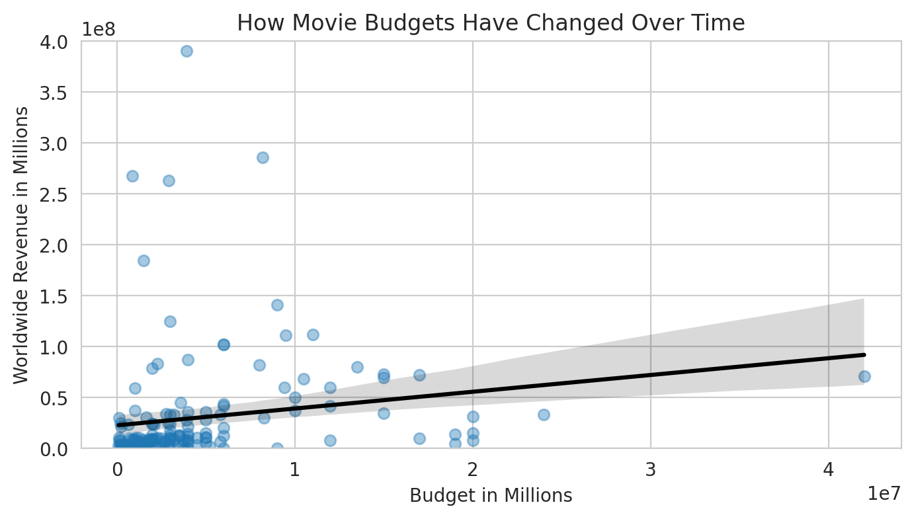
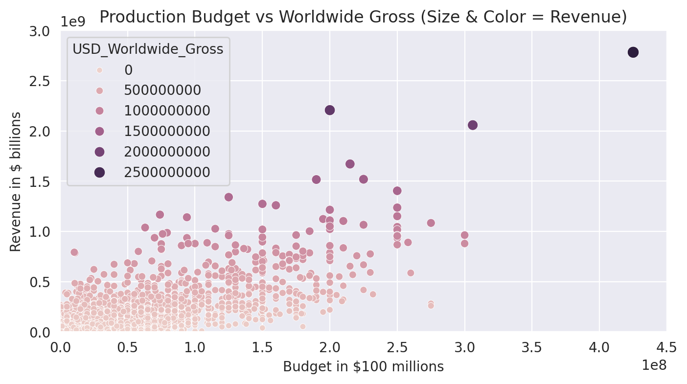
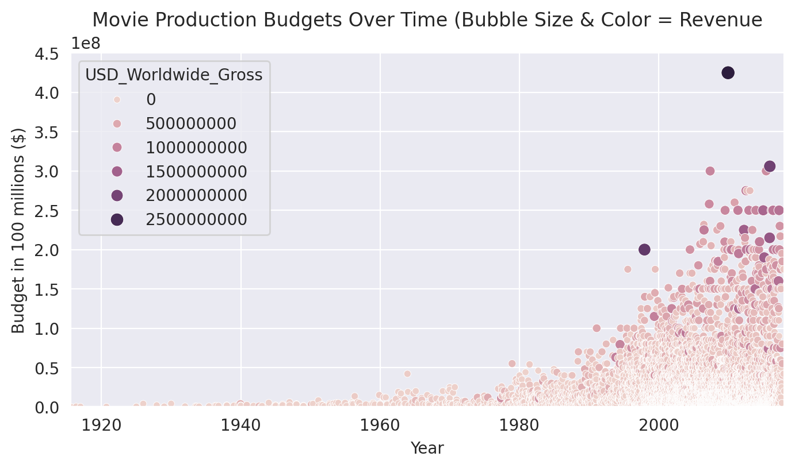
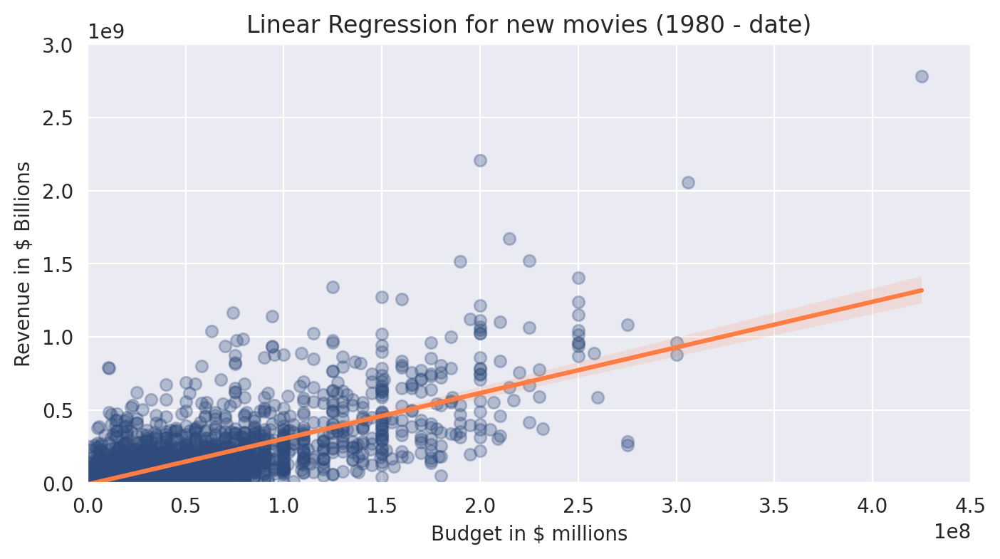

# 🎬 Movie Revenue Analysis

### 💡 Can Bigger Budgets Guarantee Bigger Profits?

Ever wondered if spending more on a movie actually leads to higher revenue?

This project explores the relationship between **movie production budgets 💸** and **worldwide revenue 🌍**, uncovering patterns, trends, and surprising insights using Python.

---

## 🚀 Why This Project Matters

In industries like film, millions are invested into production — but:

👉 Does a higher budget always mean higher returns?
👉 Are modern movies more profitable than older ones?
👉 Can we *predict* revenue based on budget?

This project answers those questions using real-world data and analytical techniques.

---

## 🧠 What I Did

Using Python and data analysis tools, I:

* 🧹 Cleaned and prepared raw movie datasets
* 📊 Explored trends in budgets and revenues over time
* 🔍 Analyzed the relationship between budget and performance
* 📈 Built a **linear regression model** to predict revenue
* 🏷️ Segmented movies into eras to compare performance

---

## 📊 Key Insights

✨ Bigger budgets generally lead to higher revenue — but not always
📉 High spending does **not guarantee profitability**
📈 Modern movies (1980–present) show stronger revenue scaling
💡 Some low-budget films outperform expectations (high ROI opportunities)

---

## 📸 Visual Highlights

### 📈 Budget Growth Over Time



### 💰 Budget vs Revenue Relationship



### 🔵 Revenue Scaling (Bubble Insight)



### 📉 Predicting Revenue (Regression Model)



---

## 🛠️ Tools Used

* Python 🐍
* Pandas & NumPy
* Seaborn & Matplotlib
* Scikit-learn
* Jupyter Notebook

---

## 📁 Project Structure

```
movie-revenue-analysis/
├── data/
│   ├── raw/
│   └── processed/
├── notebooks/
│   └── analysis.ipynb
├── visuals/
├── requirements.txt
└── README.md
```

---

## ▶️ How to Run

```bash
git clone https://github.com/yourusername/movie-revenue-analysis.git
cd movie-revenue-analysis
pip install -r requirements.txt
jupyter notebook
```

---

## 🎯 What This Project Demonstrates

✔️ Data cleaning & preprocessing
✔️ Exploratory data analysis (EDA)
✔️ Data storytelling & visualization
✔️ Basic machine learning (regression)
✔️ Business insight extraction

---

## 👨‍💻 About Me

**Edric Oghenejobor**
Backend Engineer | Python & Data Analysis

📧 [joborfrederick@gmail.com](mailto:joborfrederick@gmail.com)

---

## ⭐ Final Thought

> Data doesn’t just describe reality — it helps us make better decisions.

This project shows how data can guide investment thinking in industries like film 🎬
